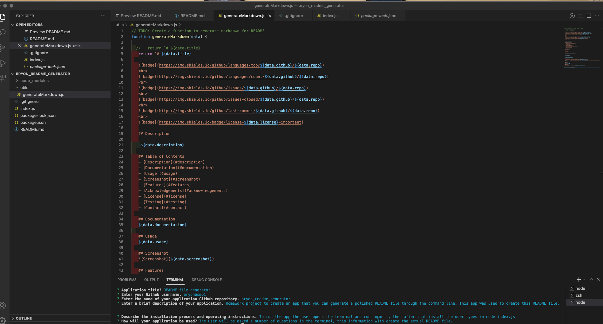

# README file generator
 
   
     
   
    
   
    
   
    
   
    
   
   
   ## Description
   
    Homework project to create an app that you can generate a polished README file through the command line. This app was used to create this README file.
  
   ## Table of Contents
   - [Description](#description)
   - [Documentation](#documentation)
   - [Usage](#usage)
   - [Screenshot](#screenshot)
   - [Features](#features)
   - [Acknowledgements](#acknowledgements)
   - [License](#license)
   - [Testing](#testing)
   - [Contact](#contact)
 
   ## Documentation
   To run the app the user opens the terminal and runs npm i , then after that install the user types in node index.js 
  
   ## Usage
   The user will be asked a number of questions in the terminal, this information with create the actual README file.
 
   ## Screenshot
   
 
   ## Features
   The app with auto generate a polished README file with the Installation,Usage, Lincense and other useful information for your README file.
   
   # Acknowledgements
   Bryon Ball bmsmb1@gmail.com
     
   ## License
   
    
   Permission to use this application is granted under the MIT license. <https://opensource.org/licenses/MIT>
 
 
   ## Testing
   No tests for this project
 
   ## Contact:
   Holler at me! <a href="mailto:bmsmb1@gmail.com">bmsmb1@gmail.com</a>